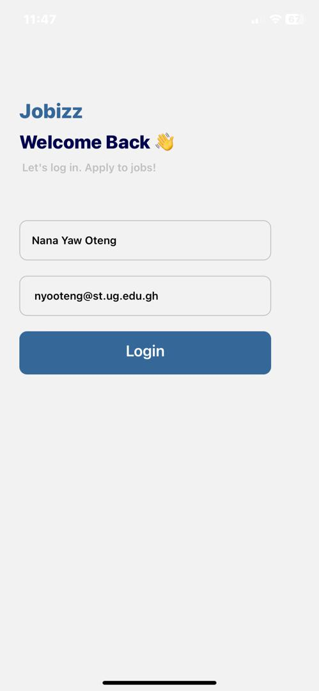
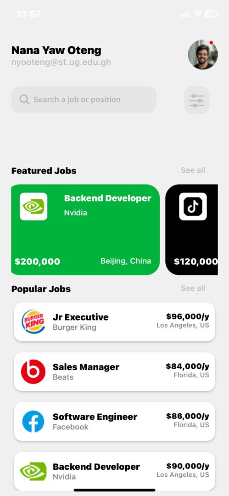
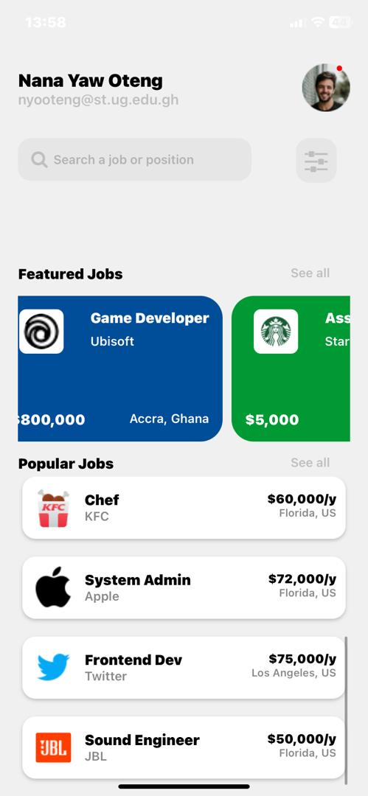

# 11038553
* The is a Job Portal application. The app allows users to browse featured and popular job listings, search for jobs, and view detailed information about each job. 

# Features
* User authentication (login)
* Browse featured jobs
* Browse popular jobs
* Search for jobs
* View detailed job information
* User profile display

# Screens
*  _**HomeScreen**_: Main screen that displays the user's name, email, and job listings.

* _**Forms**_: Login form for user authentication.

* _**Content**_: Screen displaying job listings (featured and popular jobs).

* **_Greetings_**: Welcome message for the user.

# Components
* _**FeaturedJobs**_: Component to display featured job listings.

*  _**PopularJobs**_: Component to display popular job listings.
*  _**Footer**_: Component to display social media login options.

# Cloning the repo
To application can be cloned by running the command  
`git clone https://github.com/Nana-Yaw-Oteng/rn-assignment4-11038553
` 

and then

  `cd Shoppie` to change the directory to where the app is located.

# Installing dependencies
 Run `npm install` followed by the name of the dependency to install any dependency.
 # Starting the application
 Run `npm start` to start the app.
 # Contributing
 Contributions are welcome! Please open an issue or submit a pull request for any bug fixes or enhancements.